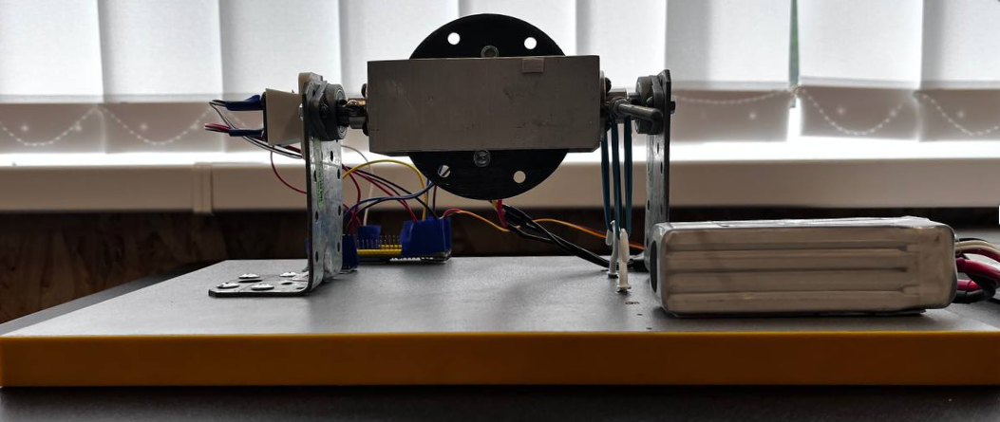
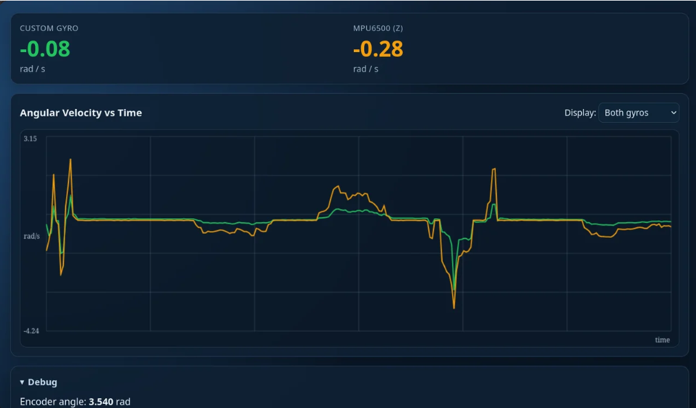

# Rate Gyro

An ESP32-S3 based single-axis rate gyroscope project. The custom gyro calculates the angular velocity of the entire construction using a magnetic encoder to track frame rotation. An MPU6500 IMU is included alongside it solely as a reference sensor to compare and validate our custom gyro's readings against a commercial standard. The system runs a local web server over a WiFi Access Point to provide real-time telemetry.

## How it Works

* **Momentum Generation:** A brushless motor driven by PWM rapidly spins a central disk to generate angular momentum. The RPM of this spinning disk is derived theoretically based on the motor's inputs and is not actively tracked.
* **Frame Tracking:** An AS5600 magnetic encoder is mounted to track the rotation angle of the inner frame (precession).
* **Rate Calculation:** As external rotational forces act on the single sensitive axis of the system, the gyroscopic effect causes the frame to deflect. The microcontroller reads the frame's angle from the encoder and uses it to calculate the angular velocity of the whole construction.
* **Reference Comparison:** An MPU6500 Inertial Measurement Unit (IMU) is attached to the system. It is not used to calculate our gyro's outputs; rather, its Z-axis data is streamed to the web UI alongside our custom gyro's data so we can directly compare our calculated angular velocity against a commercial IMU.

### Governing Principles

The system's behavior relies on fundamental gyroscopic motion and proportional relationships:

**1. Angular Momentum & Torque:**
The motor spins the disk at a constant theoretical speed, creating a constant angular momentum ($L$). When the entire construction is rotated by an outside force (angular velocity, $\Omega$), it produces a gyroscopic torque ($\tau$):

$$\tau = L \times \Omega$$

**2. Rate Measurement (The Formula for Big $\Omega$):**
Because the frame's deflection angle is proportional to the external rotational force applied to the construction, we can derive the system's angular velocity ($\Omega$) directly from the frame's angle ($\theta$). By equating the gyroscopic torque to the restoring torque of the frame, the final formula for Big Omega is:

$$\Omega = \frac{k \cdot \theta}{I \cdot \omega_{disk}}$$

* **$\Omega$**: The angular velocity of the entire construction.
* **$k$**: Torsional spring constant of the frame's restoring force.
* **$\theta$**: The deflection angle of the frame (measured by the AS5600 encoder).
* **$I$**: Moment of inertia of the spinning disk.
* **$\omega_{disk}$**: The angular velocity of the spinning disk.

In our software, these grouped mechanical parameters form our configuration constant ($C$). The software continuously unwraps the encoder angle, applies an Exponential Moving Average (EMA) low-pass filter to smooth the data, and calculates the final rate:

$$\theta_{filtered} = \alpha \cdot \theta_{continuous} + (1 - \alpha) \cdot \theta_{filtered_{prev}}$$
$$\Omega = \theta_{filtered} \cdot C$$

* **$\alpha$**: Smoothing factor (set to `0.1`).
* **$\theta_{continuous}$**: The raw, unwrapped frame angle from the encoder.
* **$C$**: The configuration constant `config.getConstantC()`.

## Hardware



### Components Used
* **Microcontroller:** ESP32-S3 (DevKitC-1)
* **Reference IMU:** MPU6500 (Used for comparison only)
* **Encoder:** AS5600 (Magnetic Encoder for frame angle)
* **Motor:** Brushless FPV motor controlled via PWM

### Pin Configuration
The hardware is wired according to the following pinout:
* **Motor PWM:** Pin `14`
* **Encoder I2C (SDA / SCL):** Pins `47` / `48`
* **IMU I2C (SDA / SCL):** Pins `20` / `21`

## Web Interface



The ESP32 broadcasts a WiFi Access Point to view live data.
* **SSID:** `ESP32_Gyro`
* **Password:** `password123`
* **Address:** Navigate to `http://192.168.4.1` in your browser.

The dashboard communicates via a JSON API hosted at `/data` which returns the sequence ID, the custom gyro's calculated angular velocity (`omega`), the raw encoder angle, and the reference IMU's Z-axis radians for comparison.

## Software & Build Instructions

This project is built using [PlatformIO](https://platformio.org/).

### Dependencies
The following libraries will be automatically resolved by PlatformIO:
* `madhephaestus/ESP32Servo` (v3.0.5)
* `as5600`

### Building and Uploading
To compile and upload the main application code via the command line, run:

```bash
pio run -e main -t upload
```

(You can also use the PlatformIO IDE extension in VSCode by selecting the main environment).
Environments

The platformio.ini file includes isolated environments to test individual subsystems independently:
- env:main - Full application
- env:test_motor - Tests motor spinout
- env:test_encoder - Tests AS5600 readings
- env:test_mpu6500 - Tests IMU I2C communication